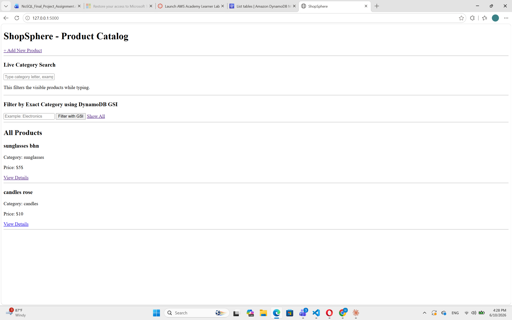
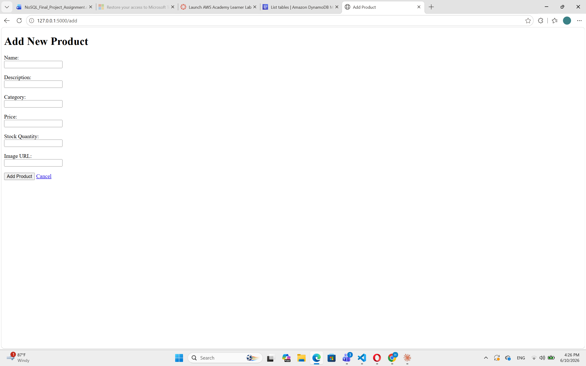
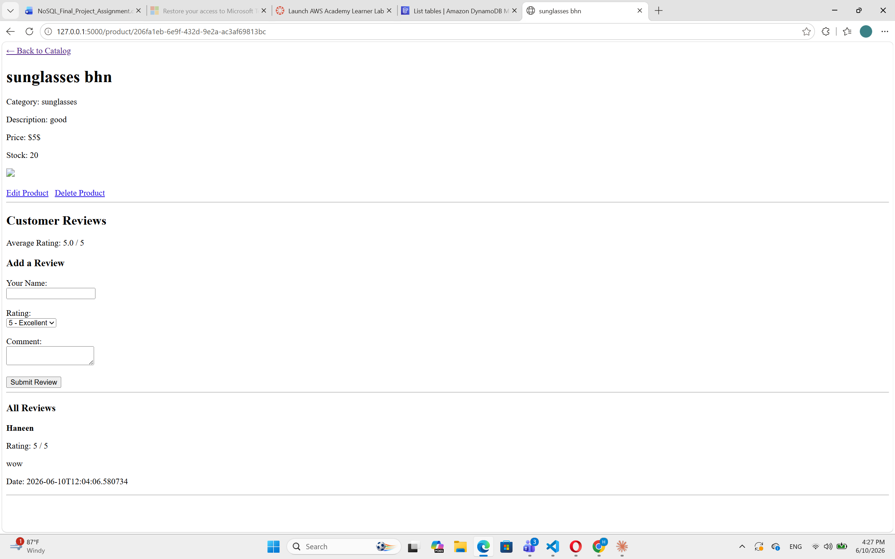
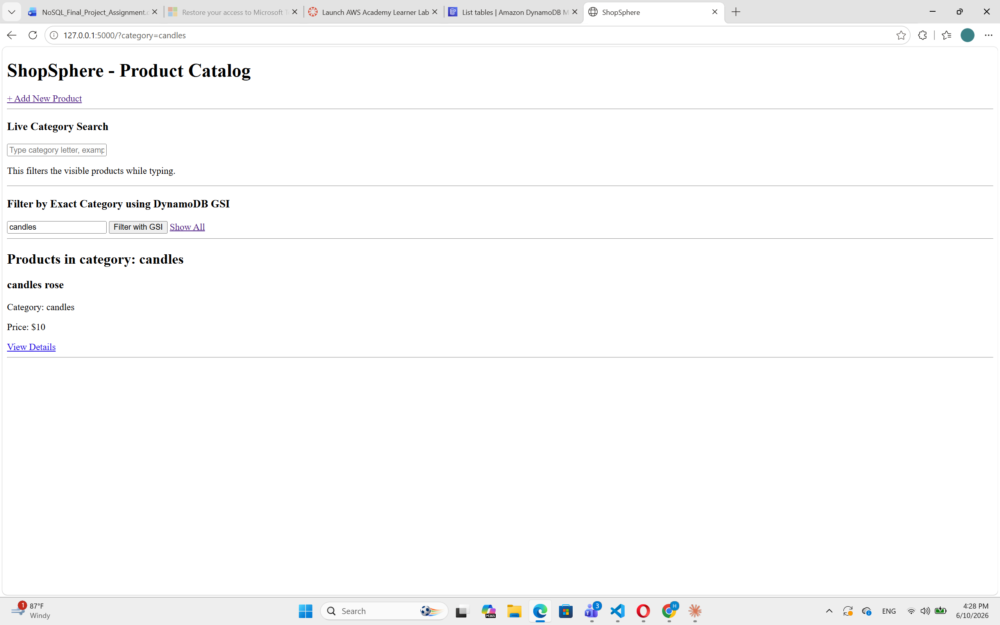

# ShopSphere - Product Catalog & Customer Feedback Platform

ShopSphere is a simple Flask web application that uses AWS DynamoDB as a NoSQL database.
The system allows users to add products, browse the product catalog, view product details, edit and delete products, and submit customer reviews with ratings.

## Technology Stack

* Python 3
* Flask
* AWS DynamoDB
* boto3
* HTML / Jinja2 templates
* python-dotenv
* GitHub

## Project Features

### Product Catalog

* Add a new product
* View all products
* View product details
* Update product details
* Delete a product
* Filter products by category

### Customer Feedback

* Submit a review for a product
* Store customer name, rating, comment, and timestamp
* Display all reviews on the product detail page
* Calculate and display average rating
* Sort reviews by newest date first

## DynamoDB Table Design

Table name: `ShopSphere`

| Attribute | Role              | Example                                |
| --------- | ----------------- | -------------------------------------- |
| PK        | Partition Key     | PRODUCT#123                            |
| SK        | Sort Key          | METADATA or REVIEW#2026-06-10T10:00:00 |
| category  | GSI Partition Key | Electronics                            |

## Item Types

### Product Item

A product is stored like this:

| Attribute   | Example            |
| ----------- | ------------------ |
| PK          | PRODUCT#abc123     |
| SK          | METADATA           |
| product_id  | abc123             |
| name        | iPhone             |
| description | Smartphone         |
| category    | Electronics        |
| price       | 500                |
| stock       | 10                 |
| image_url   | product image link |

### Review Item

A review is stored under the same product partition key:

| Attribute     | Example                    |
| ------------- | -------------------------- |
| PK            | PRODUCT#abc123             |
| SK            | REVIEW#2026-06-10T10:00:00 |
| product_id    | abc123                     |
| customer_name | Haneen                     |
| rating        | 5                          |
| comment       | Great product              |
| timestamp     | 2026-06-10T10:00:00        |

## Why This Design?

I used a single-table design because products and reviews are related.

The product item uses:

`PK = PRODUCT#product_id`
`SK = METADATA`

Each review uses:

`PK = PRODUCT#product_id`
`SK = REVIEW#timestamp`

This means all reviews for one product are stored under the same partition key.
When I need to show product reviews, I can use DynamoDB `Query` on the product partition instead of scanning the full table.

## Global Secondary Index

GSI name: `category-index`

| GSI Name       | Partition Key | Purpose                    |
| -------------- | ------------- | -------------------------- |
| category-index | category      | Query products by category |

The category filter uses DynamoDB `Query` on the `category-index`.

This is better than using `Scan` because:

* `Scan` reads every item in the table, then filters the results.
* `Query` reads only the items that match the category.
* `Query` is more efficient and cheaper at scale.

## Setup Instructions

1. Clone the repository:

```bash
git clone https://github.com/HaneenDahbour/shopsphere.git
cd shopsphere
```

2. Create and activate a virtual environment:

```bash
python -m venv venv
.\venv\Scripts\Activate.ps1
```

3. Install dependencies:

```bash
pip install -r requirements.txt
```

4. Create a `.env` file:

```env
AWS_ACCESS_KEY_ID=your_access_key
AWS_SECRET_ACCESS_KEY=your_secret_key
AWS_SESSION_TOKEN=your_session_token
AWS_REGION=us-east-1
TABLE_NAME=ShopSphere
```

5. Run the app:

```bash
python app.py
```

6. Open the browser:

```text
http://127.0.0.1:5000
```

## Daily Progress Log

### Day 1 - Setup and Design

I created the DynamoDB table named `ShopSphere` with a partition key `PK` and sort key `SK`.
I also created a GSI named `category-index` for category-based product queries and connected the Flask app to DynamoDB using boto3.

### Day 2 - Product CRUD

I implemented product creation, product listing, product detail page, product update, and product delete.
The product data is stored in DynamoDB using `PutItem`, retrieved with `GetItem` or `Scan`, updated with `UpdateItem`, and deleted with `DeleteItem`.

### Day 3 - Customer Reviews

I added a review form on the product detail page.
Reviews are stored as separate items under the same product partition key, displayed on the product page, and used to calculate the average rating dynamically.

### Day 4 - Queries and GSI

I added category filtering using the `category-index` GSI.
This allows the app to use DynamoDB `Query` for category filtering instead of scanning the full table.

## Screenshots

Screenshots should be added before final submission:

* Home page
* Add product page
* Product detail page with reviews
* Category filter result

## Security Note

The `.env` file is not committed to GitHub because it contains AWS credentials.
It is included in `.gitignore`.


## Screenshots

### Home Page



### Add Product Page



### Product Detail With Reviews



### Category Filter Result

